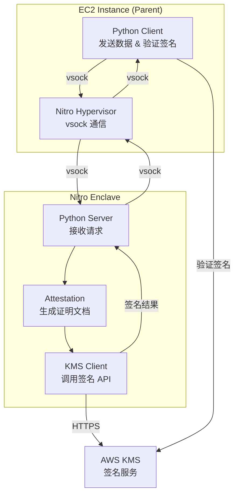
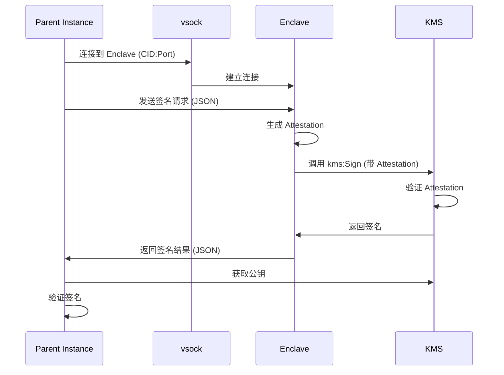

# 设计文档

## 概述

本项目实现一个极简的 EC2 Nitro Enclaves 演示，展示如何在隔离的 Enclave 环境中使用 AWS KMS 进行数字签名操作。整体架构采用客户端-服务器模式，Parent Instance（EC2 主机）作为客户端发送待签名数据，Enclave Application 作为服务器在隔离环境中执行签名操作。

### 核心流程

1. Parent Instance 启动 Enclave 并建立 vsock 通信
2. Parent Instance 发送待签名数据到 Enclave
3. Enclave 生成 Attestation Document 并调用 KMS 签名
4. Enclave 返回签名结果
5. Parent Instance 验证签名

## 架构

### 系统架构图



### 部署架构

- **区域**: us-east-1
- **EC2 实例类型**: c6i 系列（支持 Nitro Enclaves）
- **操作系统**: Amazon Linux 2023
- **Python 版本**: Python 3.12
- **Enclave 资源**: 2 vCPU, 512 MB 内存（可调整）

## 组件和接口

### 1. Parent Instance 组件

#### 1.1 Client Application (`parent_app.py`)

**职责**:
- 启动和管理 Enclave
- 通过 vsock 发送签名请求
- 接收签名结果并验证

**接口**:
```python
class EnclaveClient:
    def __init__(self, enclave_cid: int, port: int)
    def send_sign_request(self, message: str) -> dict
    def verify_signature(self, message: str, signature: bytes, key_id: str) -> bool
```

**通信协议**:
```json
// 请求格式
{
    "action": "sign",
    "message": "待签名的消息内容"
}

// 响应格式
{
    "status": "success",
    "signature": "base64编码的签名",
    "key_id": "KMS密钥ID"
}
```

#### 1.2 Enclave 管理脚本

**文件**: `start_enclave.sh`

**功能**:
- 构建 Enclave 镜像（EIF 文件）
- 分配 CPU 和内存资源
- 启动 Enclave 实例
- 获取 Enclave CID（通信标识符）

### 2. Enclave 组件

#### 2.1 Server Application (`enclave_app.py`)

**职责**:
- 监听 vsock 连接
- 处理签名请求
- 调用 KMS API 执行签名

**接口**:
```python
class EnclaveServer:
    def __init__(self, port: int)
    def start(self)
    def handle_request(self, request: dict) -> dict
    def sign_with_kms(self, message: str) -> tuple[bytes, str]
```

#### 2.2 KMS 集成模块

**职责**:
- 生成 Attestation Document
- 使用 Attestation 调用 KMS
- 处理签名操作

**关键函数**:
```python
def get_attestation_document() -> bytes
def sign_message_with_kms(message: str, key_id: str, attestation: bytes) -> bytes
```

### 3. 基础设施组件

#### 3.1 KMS 密钥

**配置**:
- 密钥类型: SIGN_VERIFY
- 密钥规格: RSA_2048 或 ECC_NIST_P256
- 密钥策略: 允许 Enclave 通过 Attestation 访问

**密钥策略示例**:
```json
{
    "Sid": "Enable enclave signing",
    "Effect": "Allow",
    "Principal": {
        "AWS": "arn:aws:iam::ACCOUNT_ID:role/EnclaveRole"
    },
    "Action": "kms:Sign",
    "Resource": "*",
    "Condition": {
        "StringEqualsIgnoreCase": {
            "kms:RecipientAttestation:ImageSha384": "ENCLAVE_IMAGE_HASH"
        }
    }
}
```

#### 3.2 IAM 角色

**EnclaveRole**:
- 附加到 EC2 实例
- 权限: `kms:Sign`, `kms:GetPublicKey`, `kms:DescribeKey`

## 数据模型

### 签名请求

```python
@dataclass
class SignRequest:
    action: str  # "sign"
    message: str  # 待签名的消息
```

### 签名响应

```python
@dataclass
class SignResponse:
    status: str  # "success" 或 "error"
    signature: str  # Base64 编码的签名（成功时）
    key_id: str  # KMS 密钥 ID（成功时）
    error: str  # 错误信息（失败时）
```

### Attestation Document

Enclave 生成的二进制文档，包含:
- PCR 值（Platform Configuration Registers）
- Enclave 镜像的 SHA384 哈希
- 公钥和签名

## 通信流程

### vsock 通信



## 错误处理

### Enclave 启动失败

**场景**: Enclave 镜像构建或启动失败

**处理**:
- 检查实例是否支持 Nitro Enclaves
- 验证资源分配（CPU、内存）
- 检查 Enclave 镜像完整性
- 输出详细错误日志

### KMS 签名失败

**场景**: KMS API 调用失败

**处理**:
- 验证 IAM 角色权限
- 检查 Attestation Document 有效性
- 验证密钥策略配置
- 返回错误信息给 Parent Instance

### vsock 通信失败

**场景**: Parent 和 Enclave 之间通信中断

**处理**:
- 实现重试机制（最多 3 次）
- 设置超时时间（30 秒）
- 记录通信错误日志
- 优雅关闭连接

### 签名验证失败

**场景**: Parent Instance 验证签名失败

**处理**:
- 检查公钥是否正确获取
- 验证消息内容一致性
- 检查签名格式
- 输出验证失败原因

## 测试策略

### 单元测试

**范围**: 核心功能模块

**测试内容**:
- JSON 序列化/反序列化
- 消息格式验证
- 错误处理逻辑

### 集成测试

**范围**: 端到端流程

**测试场景**:
1. **正常流程**: 发送消息 → 签名 → 验证成功
2. **Enclave 重启**: 重启 Enclave 后重新建立连接
3. **无效消息**: 发送格式错误的请求
4. **KMS 权限**: 测试不同的 IAM 权限配置

### 手动测试

**演示脚本**:
1. 启动 Enclave
2. 运行客户端发送签名请求
3. 显示签名结果
4. 验证签名
5. 清理资源

## 部署流程

### 1. 环境准备

```bash
# 安装 Nitro Enclaves CLI
sudo amazon-linux-extras install aws-nitro-enclaves-cli

# 配置 Enclave 资源
sudo systemctl enable nitro-enclaves-allocator.service
sudo systemctl start nitro-enclaves-allocator.service
```

### 2. 构建 Enclave 镜像

```bash
# 创建 Dockerfile
# 构建 Docker 镜像
docker build -t enclave-app .

# 转换为 EIF 格式
nitro-cli build-enclave --docker-uri enclave-app:latest --output-file enclave.eif
```

### 3. 配置 KMS

```bash
# 创建签名密钥
aws kms create-key --key-usage SIGN_VERIFY --key-spec RSA_2048

# 配置密钥策略（包含 Attestation 条件）
```

### 4. 启动演示

```bash
# 启动 Enclave
./start_enclave.sh

# 运行客户端
python3 parent_app.py
```

## 安全考虑

### Attestation 验证

- KMS 密钥策略必须验证 Enclave 的 ImageSha384
- 确保只有特定的 Enclave 镜像可以访问密钥

### 网络隔离

- Enclave 只能通过 vsock 与 Parent 通信
- Enclave 通过 Parent 的网络代理访问 KMS

### 最小权限原则

- IAM 角色只授予必要的 KMS 权限
- 密钥策略限制操作类型（仅 Sign）

## 依赖项

### Parent Instance

- Python 3.12
- boto3 (AWS SDK)
- cryptography (签名验证)

### Enclave

- Python 3.12
- boto3
- aws-nitro-enclaves-sdk-python (Attestation)

## 性能考虑

### 资源分配

- Enclave: 2 vCPU, 512 MB 内存（适合演示）
- 可根据需要调整资源

### 延迟

- vsock 通信: < 1ms
- KMS 签名: 50-200ms（网络延迟）
- 总体响应时间: < 500ms

## 可扩展性

虽然这是一个演示项目，但设计考虑了以下扩展点：

1. **多种签名算法**: 支持 RSA 和 ECC
2. **批量签名**: 修改协议支持批量请求
3. **加密操作**: 扩展支持 KMS 加密/解密
4. **监控和日志**: 集成 CloudWatch 日志
